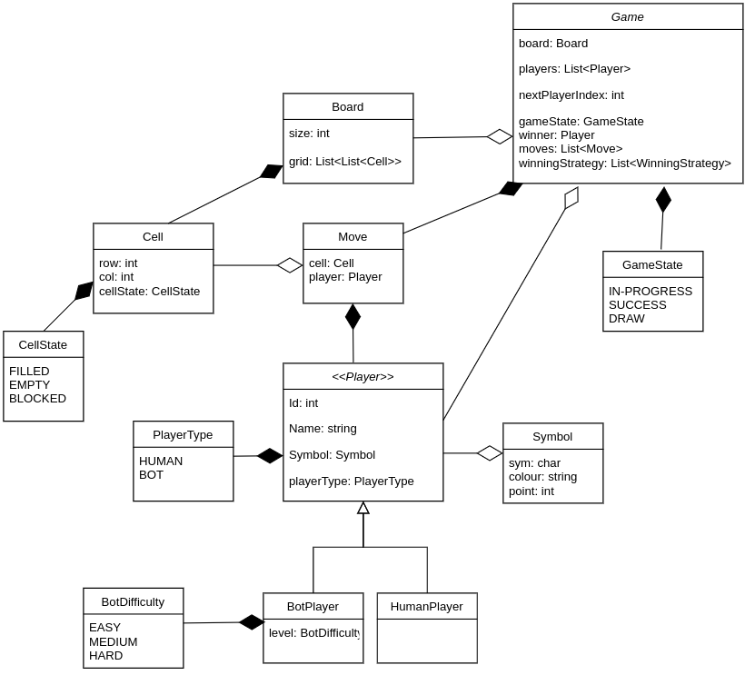

# Tic-Tac-Toe Game

## Step 1: Requirements

1. size of the board: (nXn)
2. number of players: (n-1)
3. each player can choose their own symbols
    - validations: 2 players mustn't choose the same symbol
4. Can I have a bot? (yes)
5. Can my bot have different difficulty levels?
    - easy, medium, hard
6. Who will make the first move?
   - random
7. How the winner is decided?
   - Row
   - Column
   - Diagonal
   - Corner
8. Game can also end up in a draw when no one can make a further move
9. Undo?
   - global level

## Step 2: Class Diagram

## Step 3: Deep Dive

### How to decide which player is a winner?

- Check if there is a row, column, diagonal or corner with the same symbol
- Create a Map of Pair(rowNo: int, symbol: Symbol) and store the row wise count
- Create a Map of Pair(colNo: int, symbol: Symbol) and store the col wise count

After every player's move, check in the map if either row or col count is equal to n. If yes, then that player is the winner

- Time Complexity: O(1)
- Space Complexity: O(N)
